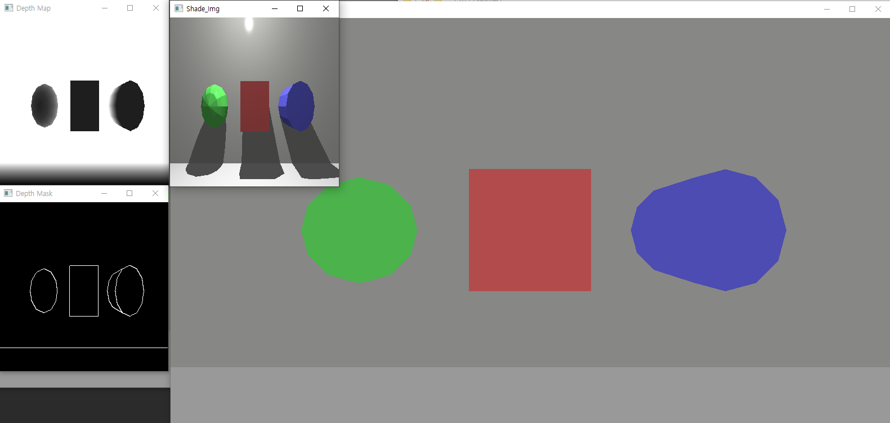
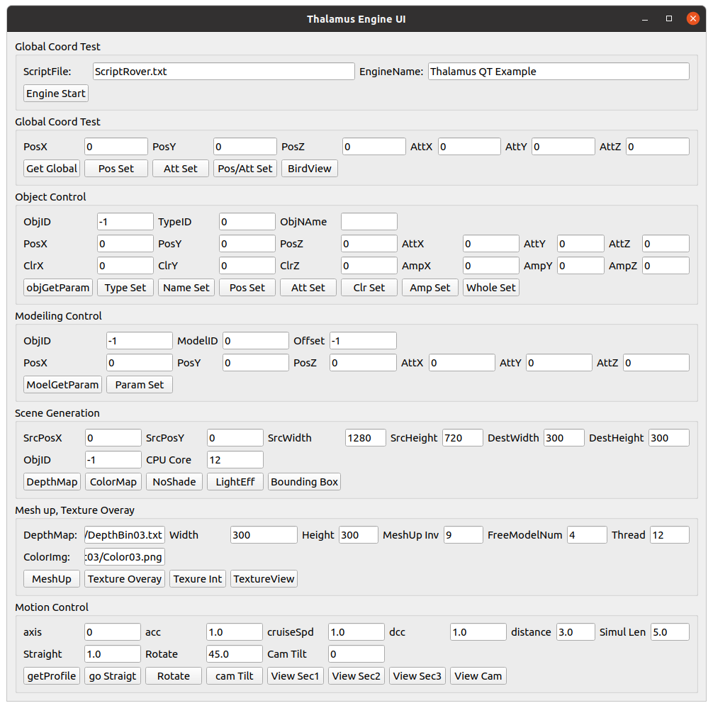
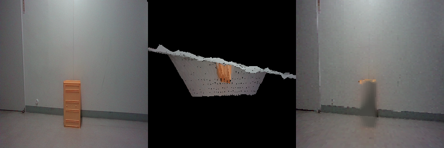

# Thalamus DLL Test code - Window / Linux
 - Tested in window 10 64bit / Ubuntu 20.
 - Downlaod  Simul3DDLL.dll, freeglut.dll, opencv_world450d.dll / thalamus.so
 - from https://drive.google.com/drive/folders/1JN-bPuIM96y6vYkXszekqJNGTuY8BF_5?usp=sharing
 - Script.txt : three objects
  
 - ScriptFreeModel.txt : one free model 
 - Depth Pnt : depth map from depth cam

# Intallation
## CLI Example
  - pip install -r requirements.txt 
## PyQT5 Example
 - pip install -r requirementsUI.txt

# Excute on Linux
 - python3 -m venv venv 
 - source venv/bin/activate
 - python3 main.py

# Excute on Window
 - virtualenv venv 
 - venv/script/activate.bat
 - python3 main.py

# UI Example, You can test every fucntion on Python

 - Engine Start with proper a model script
 - Global Coordination Test : changing point ove view
 - Object Control : change the attributes of the specific object. 
 - Modleling Control : change the attributes of the script file.
 - Scene Generation : depth map, edge, segmentation map, bounding box
 - Mesh Up, Texture Overlay: State Engine with ScriptFreeModel.txt, you can generate the scene of another angle
 - Mesh Up, Texture Overlay: State Engine with Dataset03/Script03.txt, you can manipulate the scene of deleting an object.

