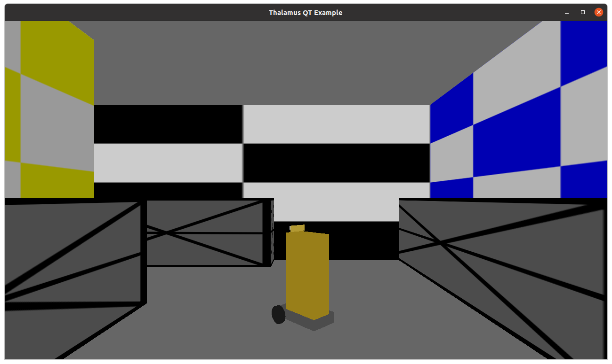

# Thalamus DLL Test code - Window / Linux
 - Tested in window 10 64bit / Ubuntu 20.
 - Downlaod  Simul3DDLL.dll, freeglut.dll, opencv_world450d.dll / thalamus.so
 - from https://drive.google.com/drive/folders/1JN-bPuIM96y6vYkXszekqJNGTuY8BF_5?usp=sharing
 - Script.txt : three objects
  
 - ScriptFreeModel.txt : one free model 
 - Depth Pnt : depth map from depth cam

# Intallation
## CLI Example
  - pip install -r requirements.txt 
## PyQT5 Example
 - pip install -r requirementsUI.txt

# NEED upgrade MCLib
 - git pull

# Excute on Linux 
 - python3 -m venv venv 
 - source venv/bin/activate
 - python3 qtRoverSimul.py #Rover Simul

# UI Example, You can test every fucntion on Python

 - Click Engine Start
 - Change View, Section 1,2,3 and Rover view
 - Rotate, go Strait, cam Tilt

